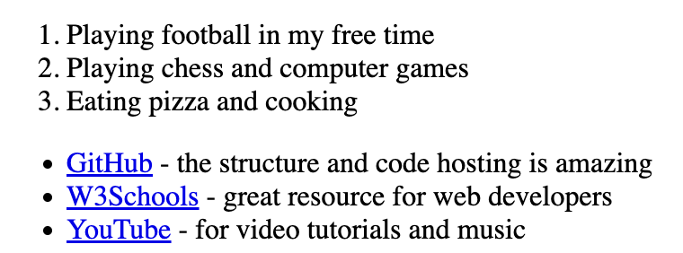
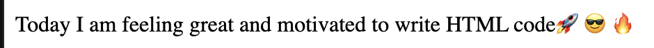

# Assignment 1: HTML & CSS Basics

**Name:** Azamat Merzemkhan  
**Group:** [Тобыңыздың атын жазыңыз, мысалы: CS-2401]  
**Course:** Web Technologies-1 (Frontend)  
**Instructor:** Gulfiya Usserbayeva  

---

## Project Overview
This repository contains my first practical assignment for the Web Technologies course. The goal of this project is to learn the basics of HTML, create structured web pages, use essential tags (headings, lists, tables, forms), and publish the website online using GitHub Pages.

---

## Completed Tasks & Screenshots

### Step 0 & 1: Basic Structure, Headings & Paragraph
- Created the standard HTML boilerplate (`<!DOCTYPE html>`, `<html>`, `<head>`, `<body>`).
- Added page title: "My First Webpage".
- Used headings from `<h1>` to `<h3>` and added an "About Me" paragraph.

---

### Step 2: Lists
- Created an ordered list (`<ol>`) for my hobbies.
- Created an unordered list (`<ul>`) with links to my favorite websites.

---

### Step 3 & 4: Images, Links & Buttons
- Added my personal photo using the `` tag.
- Added working hyperlinks using `<a>` tags (DU LMS and GitHub).
- Added a simple interactive button using `<button>`.

---

### Step 5: Tables (Class Schedule)
- Created a weekly class schedule table with 3 columns: "Subject", "Day", and "Time".
- Structured the table using `<thead>`, `<tbody>`, `<tr>`, `<th>`, and `<td>` tags.

---

### Step 6: Using Tables for Layout
- Created a two-column page layout using an HTML `<table>`.
- Left column (25% width) contains the navigation menu.
- Right column (75% width) displays the main page content.

---

### Step 7: Typing Emojis
- Wrote a paragraph describing my mood today with 3 emojis (🚀, 😎, 🔥).

---

### Step 8: HTML Forms
- Created a contact form with:
  - Name field (`type="text"`)
  - Email field (`type="email"`)
  - Color picker field (`type="color"`)
  - Submit button (`type="submit"`)

---

## Work Process Summary
During this assignment, I learned how HTML works and how browsers display web elements. I practiced writing clean HTML code from scratch in VS Code, creating text blocks, building structured tables, organizing layouts, and collecting user input through forms. Finally, I learned how to track project files with Git and publish a website using GitHub Pages.