# Assignment 1 - Web Technologies

Name: Azamat Merzemkhan
Group: IT-2513

## Objective

Build a simple personal webpage using HTML and CSS. The page includes headings, text, lists, images, links, a table, a form, and CSS styling (inline, internal, external, selectors, box model, positioning, sizing, float).

## Part 1. Introduction to HTML

### Step 0-1. HTML boilerplate and text structure

Created index.html with the basic HTML structure. Added h1, h2, h3 headings and a paragraph about myself.

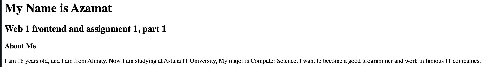

### Step 2. Lists

Added an ordered list of my hobbies and an unordered list of my favorite websites.

### Step 3. Images and links

Added my photo with the img tag and links to GitHub and LMS.

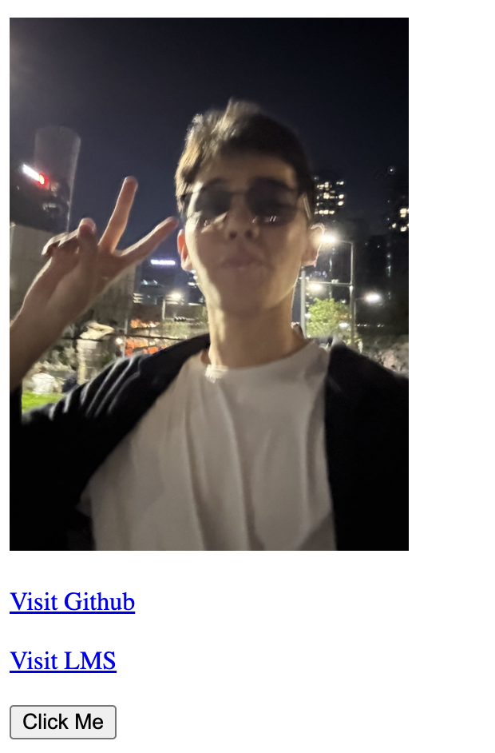

### Step 4. Button

Added a "Click Me" button.

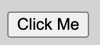

## Part 2. Intermediate HTML

### Step 5. Table

Created a table with my weekly schedule (Subject, Day, Time).

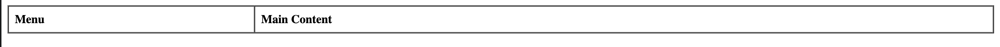

### Step 6. Layout table

Created a two-column table: menu on the left, main content on the right.

### Step 7. Emojis

Added a paragraph with emojis about my mood.

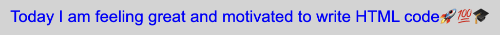

### Step 8. Form

Created a form with Name, Email, Favorite Color, and a Submit button.

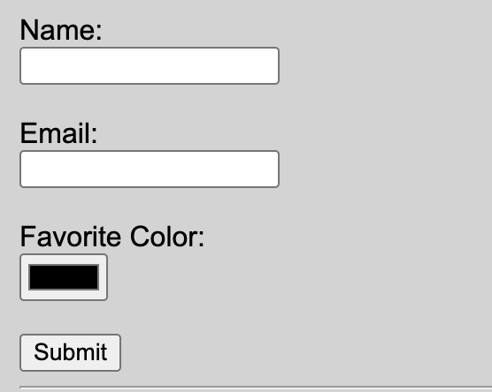

## Part 3. Introduction to CSS

### Step 9-10. Inline CSS

Used inline style on the "About Me" paragraph to change the text color.

### Step 11. Internal CSS

Added a style block in the head to set the font family.

### Step 12. External CSS

Created styles.css and linked it to the HTML file.
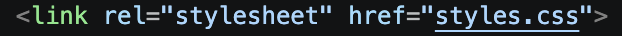

### Step 13-14. Selectors, classes and IDs

Used a p selector, a .highlight class, and an #main-heading ID with different colors and fonts.

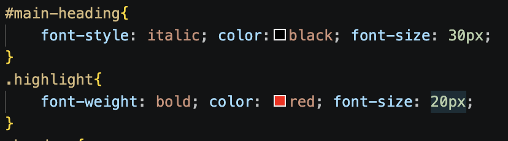

## Part 4. Intermediate CSS

### Step 15. Favicon

Added a favicon link in the head.

### Step 16. Divs

Grouped the page into header, main-content, and footer sections using divs.

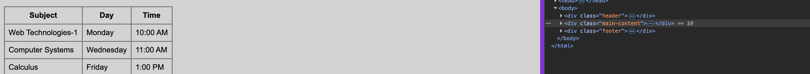

### Step 17. Box model

Added a box with border, padding, and margin.

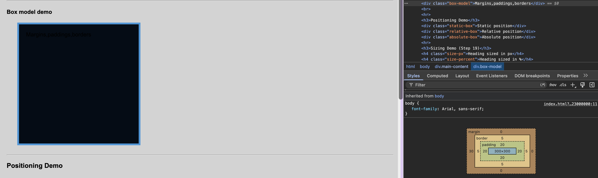

### Step 18. Positioning

Added three boxes: static, relative, and absolute.

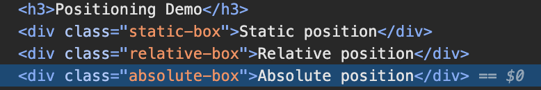

### Step 19. Sizing

Styled headings using px, %, em, and rem units.

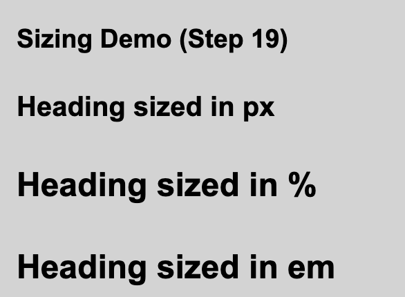

### Step 20. Float and clear

Created two floated boxes (left and right) and used clear to fix the layout.

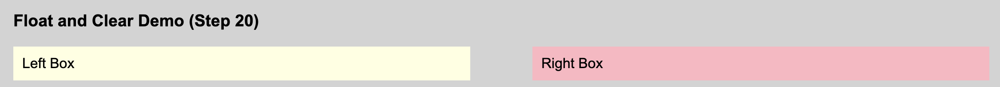

### Step 21. Publish website

Published the site on GitHub Pages.

Live link: [\[GitHub link\]](https://github.com/merzemkhanazamat/web1.git)

## Summary

I built the page step by step: first the HTML structure, then the CSS styling. I tested the page in the browser after each part. The hardest part was CSS positioning, but it works correctly now. The project is uploaded to GitHub and published with GitHub Pages.

## Files

- index.html - main page
- styles.css - external stylesheet
- images/ - photo and favicon